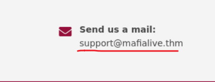
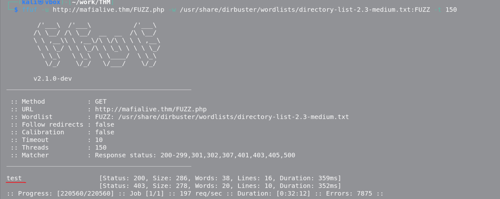
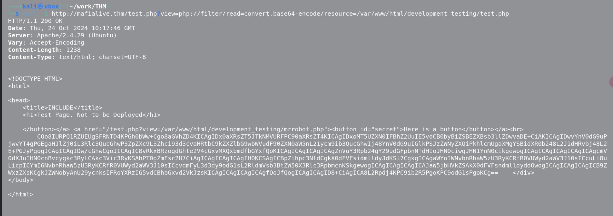
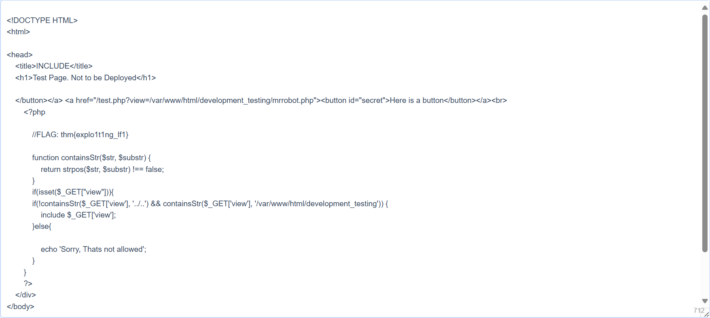

# Archangel

nmap快速扫描：
```
PORT   STATE SERVICE
22/tcp open  ssh
80/tcp open  http
```

nmap版本扫描:
```
PORT   STATE SERVICE VERSION
22/tcp open  ssh     OpenSSH 7.6p1 Ubuntu 4ubuntu0.3 (Ubuntu Linux; protocol 2.0)
| ssh-hostkey: 
|   2048 9f:1d:2c:9d:6c:a4:0e:46:40:50:6f:ed:cf:1c:f3:8c (RSA)
|   256 63:73:27:c7:61:04:25:6a:08:70:7a:36:b2:f2:84:0d (ECDSA)
|_  256 b6:4e:d2:9c:37:85:d6:76:53:e8:c4:e0:48:1c:ae:6c (ED25519)
80/tcp open  http    Apache httpd 2.4.29 ((Ubuntu))
|_http-title: Wavefire
|_http-server-header: Apache/2.4.29 (Ubuntu)
```

gobuster枚举：
```
/images               (Status: 301) [Size: 315] [--> http://10.10.202.113/images/]
/pages                (Status: 301) [Size: 314] [--> http://10.10.202.113/pages/]
/flags(这里有惊喜)                (Status: 301) [Size: 314] [--> http://10.10.202.113/flags/]
/layout               (Status: 301) [Size: 315] [--> http://10.10.202.113/layout/]
```


这里有个邮箱，后面的就是主机名
添加到hosts
直接访问就能拿到第一个flag

使用ffuf扫描：

找到正在开发的页面test.php

本地文件包含，过滤还挺严格的只能读取/development_testing文件夹下的文件，好像还不能明文读取，所以只能使用php伪协议读取test.php的源码：


第二个flag也在里面：


后面需要用到日志中毒，还要去学:(


### 查找其他主机名
答案：mafialive.thm

### 查找标志1
答案：thm{f0und_th3_r1ght_h0st_n4m3} 

### 查找正在开发的页面
答案：test.php

### 查找标志2
答案：

### 获取 shell 并找到用户标志


### 获取用户2标志


### root计算机并找到root标志