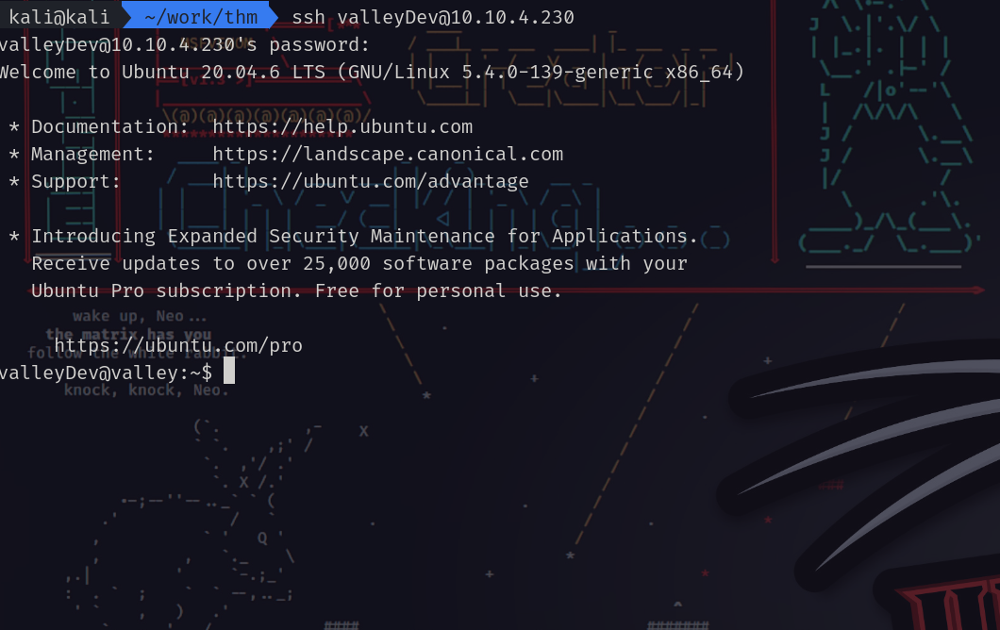

# Valley
tryhackme-esay-challenge

# 信息收集

## 快速扫描

sudo nmap -Pn --min-rate 10000 10.10.186.194
```
PORT    STATE SERVICE
22/tcp  open  ssh
25/tcp  open  smtp
80/tcp  open  http
110/tcp open  pop3
```

## 详细扫描

sudo nmap -Pn -p 22,80,25,110 -sC -sV -O 10.10.186.194
```
PORT    STATE SERVICE VERSION
22/tcp  open  ssh     OpenSSH 8.2p1 Ubuntu 4ubuntu0.5 (Ubuntu Linux; protocol 2.0)
| ssh-hostkey: 
|   3072 c2:84:2a:c1:22:5a:10:f1:66:16:dd:a0:f6:04:62:95 (RSA)
|   256 42:9e:2f:f6:3e:5a:db:51:99:62:71:c4:8c:22:3e:bb (ECDSA)
|_  256 2e:a0:a5:6c:d9:83:e0:01:6c:b9:8a:60:9b:63:86:72 (ED25519)
25/tcp  open  smtp?
|_smtp-commands: Couldn't establish connection on port 25
80/tcp  open  http    Apache httpd 2.4.41 ((Ubuntu))
|_http-title: Site doesn't have a title (text/html).
|_http-server-header: Apache/2.4.41 (Ubuntu)
110/tcp open  pop3?
Warning: OSScan results may be unreliable because we could not find at least 1 open and 1 closed port
Device type: WAP
Running: Actiontec embedded, Linux
OS CPE: cpe:/h:actiontec:mi424wr-gen3i cpe:/o:linux:linux_kernel
OS details: Actiontec MI424WR-GEN3I WAP
Service Info: OS: Linux; CPE: cpe:/o:linux:linux_kernel
```

## 漏洞扫描

sudo nmap -Pn 10.10.93.20 -p 22,25,80,110 --script=vuln
```
PORT    STATE SERVICE
22/tcp  open  ssh
25/tcp  open  smtp
80/tcp  open  http
|_http-csrf: Couldn't find any CSRF vulnerabilities.
|_http-stored-xss: Couldn't find any stored XSS vulnerabilities.
|_http-dombased-xss: Couldn't find any DOM based XSS.
110/tcp open  pop3
```

## gobuster爆破


## 网站访问

主界面有两个按钮：


第一个有一些图片，所在的文件夹只有一个文件：


第二个所在的文件夹有一个note.txt:

内容为：
`J,
Please stop leaving notes randomly on the website
-RP`这个地方可能有上传文件。

直接访问放图片的/static是空白的。

经过gobuster爆破，/static的00可以访问

```
dev notes from valleyDev:
-add wedding photo examples
-redo the editing on #4
-remove /dev1243224123123
-check for SIEM alerts
来自 valleyDev 的开发说明：
- 添加婚纱照示例
- 重做 #4 的编辑
-删除 /dev1243224123123
- 检查 SIEM 警报
```
/dev1243224123123可以访问，是一个登陆界面：

使用burp抓包，发现根本抓不到，可能用户名和密码硬编码到代码里，查看一下页面源代码：

```
username:siemDev
password:california
```
进入/dev1243224123123/devNotes37370.txt页面：

FTP 服务器的开发说明：
-停止重复使用凭据
-检查任何漏洞
-及时修补
-将 ftp 端口更改为普通端口

好了，不会了，wp启动!

原因是nmap漏了一个端口，这个端口服务是ftp，而且IP要写到hosts里转为一个域名：
sudo nmap -T4 -p- --min-rate=10000 -A Vally.thm
```
PORT      STATE SERVICE    VERSION
22/tcp    open  ssh        OpenSSH 8.2p1 Ubuntu 4ubuntu0.5 (Ubuntu Linux; protocol 2.0)
| ssh-hostkey: 
|   3072 c2:84:2a:c1:22:5a:10:f1:66:16:dd:a0:f6:04:62:95 (RSA)
|   256 42:9e:2f:f6:3e:5a:db:51:99:62:71:c4:8c:22:3e:bb (ECDSA)
|_  256 2e:a0:a5:6c:d9:83:e0:01:6c:b9:8a:60:9b:63:86:72 (ED25519)
25/tcp    open  tcpwrapped
|_smtp-commands: Couldn't establish connection on port 25
80/tcp    open  http       Apache httpd 2.4.41 ((Ubuntu))
|_http-title: Site doesn't have a title (text/html).
|_http-server-header: Apache/2.4.41 (Ubuntu)
110/tcp   open  pop3?
37370/tcp open  ftp        vsftpd 3.0.3
```

ftp登陆密码与之前网页的登陆密码相同，里面有三个数据包，需要wireshark分析：


密码在siemHTTP2.pcapng这个数据包里：

uname:valleyDev
psw:ph0t0s1234

ssh进入目标系统：


user.txt:


## 提权

/home文件夹下有一个可执行文件

查一下有没有壳：


用upx脱壳：


用ida反编译脱壳后的文件，发现一串像hash字符：

e6722920bab2326f8217e4bf6b1b58ac
用hash查找网站解一下：

e6722920bab2326f8217e4bf6b1b58ac:liberty123
dd2921cc76ee3abfd2beb60709056cfb:valley

登陆一下：


成功


