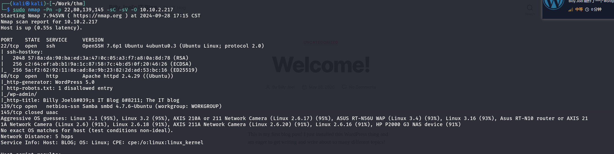

# Blog
tryhackme-challenge-medium

## 信息收集

### 端口

**nmap快速扫描**


**nmap服务扫描**


**nmap漏洞扫描**
```
PORT    STATE  SERVICE
22/tcp  open   ssh
80/tcp  open   http
| http-csrf: 
| Spidering limited to: maxdepth=3; maxpagecount=20; withinhost=blog.thm
|   Found the following possible CSRF vulnerabilities: 
|     
|     Path: http://blog.thm:80/
|     Form id: search-form-1
|     Form action: http://blog.thm/
|     
|     Path: http://blog.thm:80/category/uncategorized/
|     Form id: search-form-1
|     Form action: http://blog.thm/
|     
|     Path: http://blog.thm:80/wp-login.php
|     Form id: loginform
|     Form action: http://blog.thm/wp-login.php
|     
|     Path: http://blog.thm:80/2020/05/
|     Form id: search-form-1
|     Form action: http://blog.thm/
|     
|     Path: http://blog.thm:80/author/bjoel/
|     Form id: search-form-1
|     Form action: http://blog.thm/
|     
|     Path: http://blog.thm:80/author/kwheel/
|     Form id: search-form-1
|     Form action: http://blog.thm/
|     
|     Path: http://blog.thm:80/wp-includes/js/d.value%7Delse;,d)a.addEventListener(message,a.wp.receiveEmbedMessage,!1),b.addEventListener(DOMContentLoaded,c,!1),a.addEventListener(load,c,!1)(window,document
|     Form id: search-form-1
|     Form action: http://blog.thm/
|     
|     Path: http://blog.thm:80/wp-includes/js/d.value%7Delse;,d)a.addEventListener(message,a.wp.receiveEmbedMessage,!1),b.addEventListener(DOMContentLoaded,c,!1),a.addEventListener(load,c,!1)(window,document
|     Form id: search-form-2
|     Form action: http://blog.thm/
|     
|     Path: http://blog.thm:80/wp-login.php?action=lostpassword
|     Form id: lostpasswordform
|_    Form action: http://blog.thm/wp-login.php?action=lostpassword
|_http-stored-xss: Couldn't find any stored XSS vulnerabilities.
|_http-sql-injection: ERROR: Script execution failed (use -d to debug)
|_http-dombased-xss: Couldn't find any DOM based XSS.
| http-slowloris-check: 
|   VULNERABLE:
|   Slowloris DOS attack
|     State: LIKELY VULNERABLE
|     IDs:  CVE:CVE-2007-6750
|       Slowloris tries to keep many connections to the target web server open and hold
|       them open as long as possible.  It accomplishes this by opening connections to
|       the target web server and sending a partial request. By doing so, it starves
|       the http server's resources causing Denial Of Service.
|       
|     Disclosure date: 2009-09-17
|     References:
|       https://cve.mitre.org/cgi-bin/cvename.cgi?name=CVE-2007-6750
|_      http://ha.ckers.org/slowloris/
| http-wordpress-users: 
| Username found: bjoel
| Username found: kwheel
|_Search stopped at ID #25. Increase the upper limit if necessary with 'http-wordpress-users.limit'
|_http-aspnet-debug: ERROR: Script execution failed (use -d to debug)
139/tcp open   netbios-ssn
145/tcp closed uaac

Host script results:
| smb-vuln-regsvc-dos: 
|   VULNERABLE:
|   Service regsvc in Microsoft Windows systems vulnerable to denial of service
|     State: VULNERABLE
|       The service regsvc in Microsoft Windows 2000 systems is vulnerable to denial of service caused by a null deference
|       pointer. This script will crash the service if it is vulnerable. This vulnerability was discovered by Ron Bowes
|       while working on smb-enum-sessions.
|_          
|_smb-vuln-ms10-061: false
|_smb-vuln-ms10-054: false

Nmap done: 1 IP address (1 host up) scanned in 3268.92 seconds
```

smb枚举：


BillySMB可以匿名登陆：


找到一个登陆页面：


